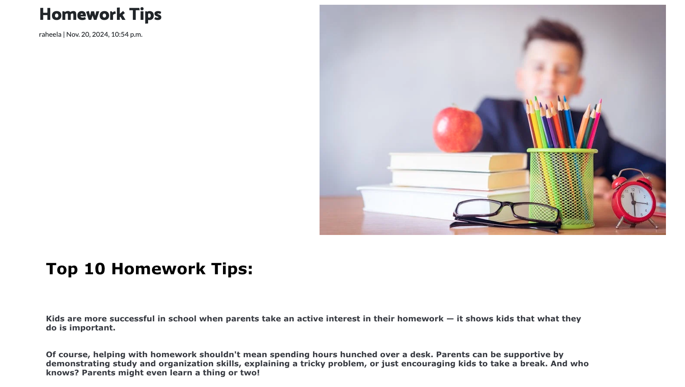
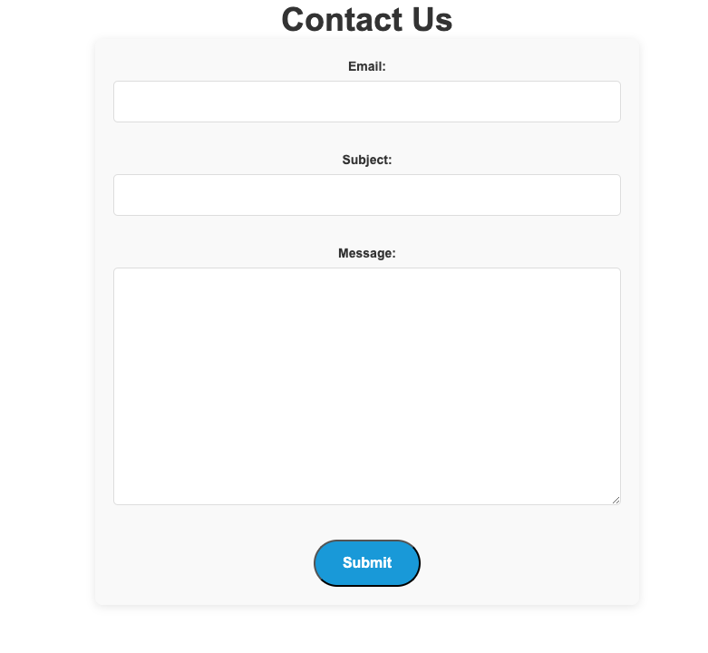

# Parentingram 


As the name suggests, Parentingram is a community platform designed for parents. It's a place where parents can come together to share ideas, tips, and experiences related to parenting. You can find a variety of content, including healthy recipes, lunch ideas, educational posts, activity sheets, and information about local events and sports.
The platform also allows you to engage with other parents by commenting on posts and expressing your likes or dislikes.

## UX

The design philosophy was to create a simple blog where user can see post and share posts and share their comment on other posts. 

### Colour Scheme


The color scheme uses bright full of life colors like(pink, orange, red, white and black color for footer) which is present throughout the site.


I used a bootstrap template to bring colors to my website which is linked below:

[Bootstrap Template](https://github.com/StartBootstrap/startbootstrap-one-page-wonder/tree/master)


## User Stories

All user stories can be found in a linked GitHub project [here](https://github.com/users/raheelaahmed/projects/4)


## Features:

Parentingram is community blog it has a number of features:

* User can see posts
* User can search the post in search bar by post title,content and authors name.
* After logging in user canlike or dislike the posts.
* After logging in User can comment on posts post.
* After logging in User can make their own post using post form, update and delete their post.(user can only update or delete their own posts)
* After loggin in User can send message to Admin.

## Nav bar:

Nav bar 6 items when user is not logged in.

* PARENTINGRAM LOGO:

logo is on the left side on Nav bar.

* HOME:

Home is the link for the homepage, when all the posts are displayed.

* ABOUT:

About the blog and its purpose.

* REGISTER :

Register page has a form so user can sign up for the form.

* LOGIN:

If your already a user you can lonin from this page or you can sign up as anew user as well.

* SEARCH:

This feature allows the user to search for the posts.


Once you are loggedin then Create feature apears on Navbar.


* LOGOUT:

now you can see Logout, you can logout using this feature.

* CREATE:

This is very important feature of website, you can create your own post using this button. it only appears if you are loggedin on the website.

### Site Pages

- **Homepage**

    - The main homepage for the site. All the posts are displayed on the this page, you can scroll up and down to see post, using next button you can go on next page to see more posts.
    post images are displayed, user can open the post by clicking on the image.


- **About Page**

    - About page. Gives users essential information about the blog and the purpose of the blog.


- **Create Page**

    - User can create a post using create post form, Post have 4 Fields(Image, Title, Author and content ). it is important to include first 3 fields other wise form will not work. User can publish the post on page after slecting published from  status list. your post will be posted on home page on clicking create Post button. you will recieve a success message with a link to view the post on home page.

    


- **Post_detail**


User can see the post-detail page once click or taps on the post image on home page. It has post title, date when the post was created, author's name , image and content.
if user is logged in then he can like or dislike the post and can make a comment on the post as well. If user is the author of the post he can edit or delete the post as well.
If user is not logged in, he can see the post and deils but can not like, dislike and comment.





- **Update-post**

If user is the author of the post then he can edit the post on clicking edit button on post detail page.
once user click editpost button a new page is displayed with an update form on it ,user can make necessary changes and click on update button post will be updated and post detail will be opeded where user can see his updated post and a success message that you post ahve been updated.


- **Contact Page**


    - Contact Page. In the footer there is a link contact us, a new page will be opened on clicking contact us. it has a form and you can send direct messages to admin.



- **Register Page**

    - Register Page. Displays a form that new users of the site can fill in and make an account. The form is short, simple, and clean to encourage users to use it.


- **Login Page**

    - Login Page. Displays a login form that existing users can use to log in to the site. Two simple input fields for username and password make it easy for users to log in to their account. A sign up button at the bottom of the page lets users who do not yet have an account easily find the register page


- **Logout Page**

    - Logout Page. A simple page confirming that the user has logged out of their account. 


- **Custom Error Pages**

    - Custom error handler pages. These pages display when a user encounters one of the following common errors: 400, 403, 404, 500. These provide a more user-friendly error page than the user would see otherwise and includes an informative message and button to return home to the site. 


### User Features


* User can see posts if he is not logged in.
* User can open the post and see the full post.
* User can search for the post in seach-bar in nav-bar.

once user is logged in 

* A new CREATE button apears in nav-bar, User can create his own post using font end form.
* User can update and delete the post if they are the author of the post.
* User can leave a comment on the posts.
* User can edit and delete their own comments.
* User can like/unlike the post.
* user can send messages to admin through contact us.


### Admin Features

* on the front end Admin can craete the post using create form.
* Admin can update and delete their own posts.
* Admin can delete all posts.
* Admin can like/dislike posts.
* Admin can post comment on the posts.

on the admin pannel

* Admin can create post,update post,delete posts.
* Admin can aprrove comments.
* Admin can update about page.
* Admin can see message sent by user.
* Admin recieve the users messages in email as well.
* Admin can update and delete all post using admin pannel.


## Tools & Technologies Used


- [HTML](https://en.wikipedia.org/wiki/HTML) used for the main site content.
- [CSS](https://en.wikipedia.org/wiki/CSS) used for the main site design and layout.
- [CSS Flexbox](https://www.w3schools.com/css/css3_flexbox.asp) used for an enhanced responsive layout.
- [CSS Grid](https://www.w3schools.com/css/css_grid.asp) used for an enhanced responsive layout.
- [JavaScript](https://www.javascript.com) used for user interaction on the site.
- [Python](https://www.python.org) used as the back-end programming language.
- [Git](https://git-scm.com) used for version control. (`git add`, `git commit`, `git push`)
- [GitHub](https://github.com) used for secure online code storage.
- [Gitpod](https://gitpod.io) used as a cloud-based IDE for development.
- [Bootstrap](https://getbootstrap.com) used as the front-end CSS framework for modern responsiveness and pre-built components.
- [Django](https://www.djangoproject.com) used as the Python framework for the site.
- [PostgreSQL](https://www.postgresql.org) used as the relational database management.
- [ElephantSQL](https://www.elephantsql.com) used as the Postgres database.
- [Heroku](https://www.heroku.com) used for hosting the deployed site.
- [Cloudinary](https://cloudinary.com) used for online static file storage.
- [Pillow](https://pypi.org/project/Pillow/) used for image processing
- [Gunicorn](https://gunicorn.org/) used for WSGI server
- [sycopg2](https://pypi.org/project/psycopg2/) used as a PostgreSQL database adapter

## Database Design

While planning this project, I drew up an Entity Relationship Diagram to help me to visualise the database models and their relationships. 


## Django project Parentingram:

I have craeted a project named as Parentingram. It has 3 apps

* blog
* about
* contact us

### blog:

* blog app has 2 models in model.py Post and Comment.
* blog app has 6 main html pages in templates and error pages.
main pages are Home page (index.html), post detail page(post_detail.html), template for creating posts(create_post), (post_delete.html) and (update_post.html) for deleting and updating post. finally it has page for search feature(search_post) all the search result are dispalyed on this page.
* blog app has views for all the templates in views.py file.
* blog app has all the url for views in urls.py.
* blog app has form.py which has all the form used for createing and updating posts it has comment form as well.


### about:

* about app has one model About for about page.
* about app has one page about and error pages.
* about app has veiws in views.py.
* about app has url for in urls.py.


### contact_us:

* contact_us app is used to send messages to admin.
* contact_us app has its model in model.py.
* contact_us app has views in views.py.
* contact_us app has contact-form in form.py as app send mesaages using front end form.
* contact_us app has 1 main template that a form to send messages.
* contact_us app has url in urls.py file.


### GitHub Projects


### GitHub Issues


## Testing

For all testing, please refer to the [TESTING.md](TESTING.md) file.

## Deployment

The live deployed application can be found deployed on [Heroku](https://parentigram-0cf4fc00ca66.herokuapp.com).

### ElephantSQL Database

This project uses [ElephantSQL](https://www.elephantsql.com) for the PostgreSQL Database.

To obtain your own Postgres Database, sign-up with your GitHub account, then follow these steps:
- Click **Create New Instance** to start a new database.
- Provide a name (this is commonly the name of the project: bushy-park-tennis-club-ld).
- Select the **Tiny Turtle (Free)** plan.
- You can leave the **Tags** blank.
- Select the **Region** and **Data Center** closest to you.
- Once created, click on the new database name, where you can view the database URL and Password.

### Cloudinary API

This project uses the [Cloudinary API](https://cloudinary.com) to store media assets online, due to the fact that Heroku doesn't persist this type of data.

To obtain your own Cloudinary API key, create an account and log in.
- For *Primary interest*, you can choose *Programmable Media for image and video API*.
- Optional: *edit your assigned cloud name to something more memorable*.
- On your Cloudinary Dashboard, you can copy your **API Environment Variable**.
- Be sure to remove the `CLOUDINARY_URL=` as part of the API **value**; this is the **key**.

### Heroku Deployment

This project uses [Heroku](https://www.heroku.com), a platform as a service (PaaS) that enables developers to build, run, and operate applications entirely in the cloud.

Deployment steps are as follows, after account setup:

- Select **New** in the top-right corner of your Heroku Dashboard, and select **Create new app** from the dropdown menu.
- Your app name must be unique, and then choose a region closest to you (EU or USA), and finally, select **Create App**.
- From the new app **Settings**, click **Reveal Config Vars**, and set your environment variables.

| Key | Value |
| --- | --- |
| `CLOUDINARY_URL` | user's own value |
| `DATABASE_URL` | user's own value |
| `DISABLE_COLLECTSTATIC` | 1 (*this is temporary, and can be removed for the final deployment*) |
| `SECRET_KEY` | user's own value |

Heroku needs two additional files in order to deploy properly.
- requirements.txt
- Procfile

You can install this project's **requirements** (where applicable) using:
- `pip3 install -r requirements.txt`

If you have your own packages that have been installed, then the requirements file needs updated using:
- `pip3 freeze --local > requirements.txt`

The **Procfile** can be created with the following command:
- `echo web: gunicorn app_name.wsgi > Procfile`
- *replace **app_name** with the name of your primary Django app name; the folder where settings.py is located*

For Heroku deployment, follow these steps to connect your own GitHub repository to the newly created app:

Either:
- Select **Automatic Deployment** from the Heroku app.

Or:
- In the Terminal/CLI, connect to Heroku using this command: `heroku login -i`
- Set the remote for Heroku: `heroku git:remote -a app_name` (replace *app_name* with your app name)
- After performing the standard Git `add`, `commit`, and `push` to GitHub, you can now type:
	- `git push heroku main`

The project should now be connected and deployed to Heroku!

### Local Deployment

This project can be cloned or forked in order to make a local copy on your own system.

For either method, you will need to install any applicable packages found within the *requirements.txt* file.
- `pip3 install -r requirements.txt`.

You will need to create a new file called `env.py` at the root-level,
and include the same environment variables listed above from the Heroku deployment steps.

Sample `env.py` file:

```python
import os

os.environ.setdefault("CLOUDINARY_URL", "user's own value")
os.environ.setdefault("DATABASE_URL", "user's own value")
os.environ.setdefault("SECRET_KEY", "user's own value")

# local environment only (do not include these in production/deployment!)
os.environ.setdefault("DEBUG", "True")
```

Once the project is cloned or forked, in order to run it locally, you'll need to follow these steps:
- Start the Django app: `python3 manage.py runserver`
- Stop the app once it's loaded: `CTRL+C` or `⌘+C` (Mac)
- Make any necessary migrations: `python3 manage.py makemigrations`
- Migrate the data to the database: `python3 manage.py migrate`
- Create a superuser: `python3 manage.py createsuperuser`
- Load fixtures (if applicable): `python3 manage.py loaddata file-name.json` (repeat for each file)
- Everything should be ready now, so run the Django app again: `python3 manage.py runserver`

#### Cloning

You can clone the repository by following these steps:

1. Go to the [GitHub repository](https://github.com/raheelaahmed/parentingram/tree/main) 
2. Locate the Code button above the list of files and click it 
3. Select if you prefer to clone using HTTPS, SSH, or GitHub CLI and click the copy button to copy the URL to your clipboard
4. Open Git Bash or Terminal
5. Change the current working directory to the one where you want the cloned directory
6. In your IDE Terminal, type the following command to clone my repository:
	- [`git clone'](https://github.com/raheelaahmed/parentingram/tree/main)
7. Press Enter to create your local clone.


#### Forking

By forking the GitHub Repository, we make a copy of the original repository on our GitHub account to view and/or make changes without affecting the original owner's repository.
You can fork this repository by using the following steps:

1. Log in to GitHub and locate the [GitHub Repository](https://github.com/raheelaahmed/parentingram/tree/main)
2. At the top of the Repository (not top of page) just above the "Settings" Button on the menu, locate the "Fork" Button.
3. Once clicked, you should now have a copy of the original repository in your own GitHub account!

### Local VS Deployment

The local version, created on Gitpod, does not have the functionality to send confirmation emails. This is due to the fact that Gitpod blocks the necessary email port required to carry out this operation. Gitpod blocks this port by default due to concerns about email spam and it cannot be changed.

## Credits


### Resources:

* Bootstrap.

I used  2  bootstrap template for the project
[bootstrap](https://github.com/StartBootstrap/startbootstrap-one-page-wonder/blob/master/dist/index.html)

[bootstrap readme](https://github.com/startbootstrap/startbootstrap-one-page-wonder?tab=readme-ov-file#start-bootstrap---one-page-wonder)

other one I have used from code institute walkthrough project for displaying content on home page.


* Pictures:
pictures from Shutterstock and pexels.
[Pexels](https://www.pexels.com/)
[shutterstock](https://www.shutterstock.com/images)

* Post Articals:

I have used folloing website for articals that I have posted on my website.

[Education](https://www.education.com/?_gl=1*qrwymn*_up*MQ..*_gs*MQ..*_ga*MTgxNjI3NTk4NC4xNzMyNzEyMDI3*_ga_QRNDCDR42R*MTczMjc3NDYxNS4yLjAuMTczMjc3NDc0My4wLjAuMA..&gclid=Cj0KCQiAo5u6BhDJARIsAAVoDWsLMdhwZDqFTVKurTeRGM8fRLYbUnI9dw7DI0LZPNhabTaN7-kvrLgaAmYOEALw_wcB)

[HSE](https://www2.hse.ie)

[Kids Health](https://kidshealth.org/en/kids/fit-kid.html?ref=search)

[Understood](https://www.understood.org/en)

[heallth](https://www.healthyfood.com/)


### Acknowledgements

- I would like to thank my Code Institute mentor for their support throughout the development of this project.
- I would like to thank the [Code Institute](https://codeinstitute.net) tutor team for their assistance with troubleshooting and debugging some project issues.
- I would like to thank the [Code Institute Slack community](https://code-institute-room.slack.com) for the moral support; it kept me going during periods of self doubt and imposter syndrome.


