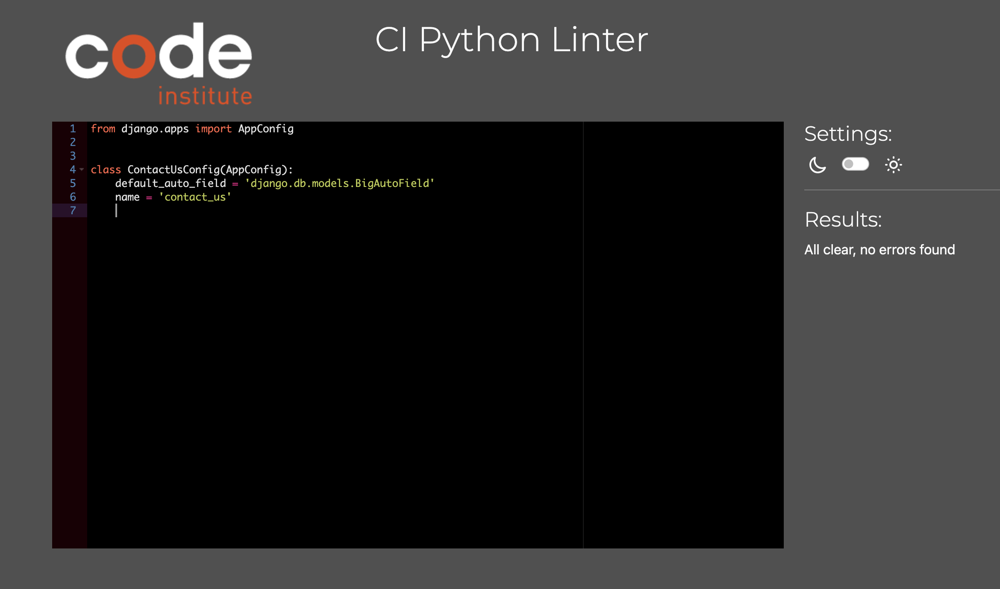
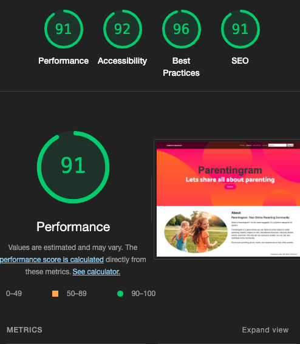
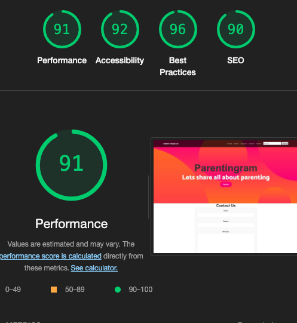
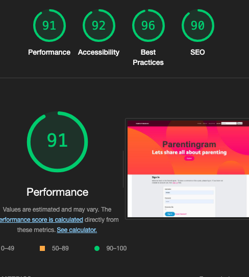

# Testing:

## HTML Validation:

# Testing

Return back to the [README.md](README.md) file.

## Code Validation

### HTML

I have used the recommended [HTML W3C Validator](https://validator.w3.org) to validate all of my HTML files.

| Page  | Screenshot | Notes |
| ---|  --- | --- |
| Home||pass(No Errors)|
| About| |Pass (No Errors)|
| Search| | Pass(No Errors) |
| Login| |Pass(No Errors)|
|Logout||Pass(No Errors)|
|Register|  --- | --- |
|Create-post|  --- | --- |
|Update-Post|  --- | --- |
|Delete-Post|  --- | --- |
|Post-Detail|  --- | --- |
|Contact-us|  --- | --- |

### CSS

I have used the recommended [CSS Jigsaw Validator](https://jigsaw.w3.org/css-validator) to validate all of my CSS files.

| File | Screenshot | Notes |

| --- | --- | --- | 

|Parentingram| |Pass(No Errors)|

### JavaScript

I have used the recommended [JShint Validator](https://jshint.com) to validate all of my JS files.

| File | Screenshot | Notes |
| --- | --- | --- |

| comments.js |  | Pass: No Errors |
| create-post.js |  | Pass: No Errors |

### Python

I have used the recommended [PEP8 CI Python Linter](https://pep8ci.herokuapp.com) to validate all of my Python files.

#### Validation For Parentingram
| File | CI URL | Screenshot | Notes |
| --- | --- | --- | --- |
| asgi.py | [PEP8 CI]() |  | Pass: No Errors |
| settings.py | [PEP8 CI]() |  | Pass: No Errors |
| urls.py | [PEP8 CI]() |  | : 1 Errors(Long Line Error) |
| wsgi.py | [PEP8 CI]() |  | Pass: No Errors |

#### Validation For blog App
| File | CI URL | Screenshot | Notes |
| --- | --- | --- | --- |
| admin.py | [PEP8 CI]() |  | Pass: No Errors |
| apps.py | [PEP8 CI]() |  | Pass: No Errors |
| forms.py | [PEP8 CI]() |  | Pass: No Errors |
| models.py | [PEP8 CI]() |  | :  No Errors |
| views.py | [PEP8 CI]() |  | : Error 501(line too long) |
| urls.py | [PEP8 CI]() |  | : Error 501(line too long) |

#### Validation For about App
| File | CI URL | Screenshot | Notes |
| --- | --- | --- | --- |
| admin.py | [PEP8 CI]() |  | Pass: No Errors |
| apps.py | [PEP8 CI]() |  | Pass: No Errors |
| models.py | [PEP8 CI]() |  | Pass: No Errors |
| urls.py | [PEP8 CI]() |  | Pass: No Errors |
| views.py | [PEP8 CI]() |  | Pass: No Errors |

#### Validation For contact-us App
| File | CI URL | Screenshot | Notes |
| --- | --- | --- | --- |
| admin.py | [PEP8 CI]() |  | Pass: No Errors |
| apps.py | [PEP8 CI]() |  | Pass: No Errors |
| models.py | [PEP8 CI]() |  | Pass: No Errors |
| form.py | [PEP8 CI]() |  | Pass: No Errors |
| urls.py | [PEP8 CI]() |  | Pass: No Errors |
| views.py | [PEP8 CI]() |  | :  Errors 501(line too long) |

## Browser Compatibility

I've tested my deployed project on  browsers to check for compatibility issues.

* It was working fine on safari.
* it was working fine on chorome.

## Responsiveness

I've tested my deployed project on multiple devices to check for responsiveness issues.

## Lighthouse Testing:

### Website App Templates - Desktop Testing
| Page |Screenshot | ---|
| --- | --- | --- |
| Home |   | 
| About |   | 
| Contact-us |   | 
| Create-post |  | 
| Update-post |   | 
| Post-Detail |  | 
| Delete-post |  |
| Seach-post |  | 
| Login |  |
| Logout |   | 
| Register  |   | 
| Custom Error page| ![Error-page] | No warnings |

## Defensive Programming

Defensive programming was manually tested with the below user acceptance testing:

| Page | User Action | Expected Result | Pass/Fail | Comments |
| --- | --- | --- | --- | --- |
| Nav links | | | | |
| | Click on Home link in navbar | Redirection to Home page | Pass | |
| | Click on About link in navbar | Redirection to About page | Pass | |
| | Click on Register link in navbar | Redirection to Register page | Pass | |
| | Click on Login link in navbar | Redirection to Login page | Pass | |
| | Click on post Image | Redirection to that post details page | Pass | |
| | Click on Pagination next double arrow | Redirection to next pagination page | Pass | |
| | Click on Pagination previus double arrow | Redirection to previous pagination page | Pass | |
| | Click on Search button in navbar |redirects to search page |Pass | |
| | click on Create link in navBar is only visible when user is loggedin| open Create post page|  Pass|  |
| Register | | | | |
| | Enter valid email address | Field will only accept email address format | Pass | |
| | Enter valid password (twice) | Field will only accept password format | Pass | |
| Login | | | | |
| | Enter valid password| Field will only accept password format | Pass| |
| | Click Login button|  Redirects user to home page | Pass| |
| Logout | | | | |
| | Click Logout button | Logs out user, Redirects user to logout page | Pass |

## User Story Testing

| User Story | Screenshot |
| --- | --- |

## Bugs

-   homepge  page was not opening.

   

    - To fix this, i logged in in admin pannel and deleted the last post(with out slug), and then it started working.

- Author:

    
     - I have an author field on my create post page which have foriegn key and was display all the user names as option.

          - To fix it, I removed author field form form and added it in create post view.

 - Slug-field: 

       - I have slug field in my create post form, but users were unaware of slug term.

           - I hide slug field using form label to empty string and used java script to target input field, then I added in the model to slugify title of the post and add it in the form.

- Search:

     -  I had error 404 for search page.

          - I fixed it by bring the url on 2nd line of url path.

- Error 404:

       - There was an error opening the post detail.

       

       - I fixed it by fixing the url postion.

 - Data base error:

    - There was an error i was unable to access my website.

      

    - I was able to fix it with the help of tutor support, who advised me to delete all migrations and then use a new data base.

    
## Unfixed Bugs

There are few bug in Django formm and sumernote that are seen in html validation. I was unable to clear them.

