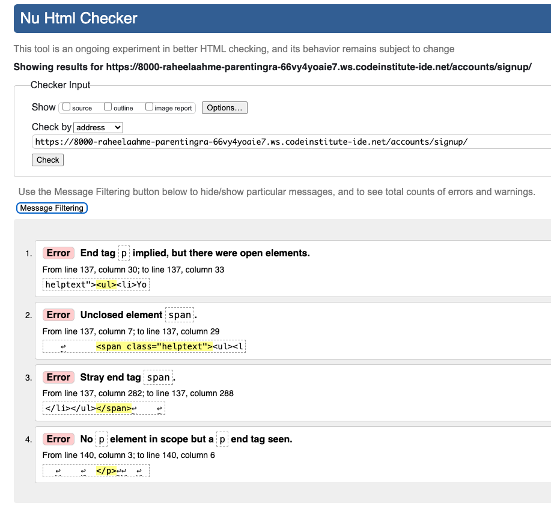
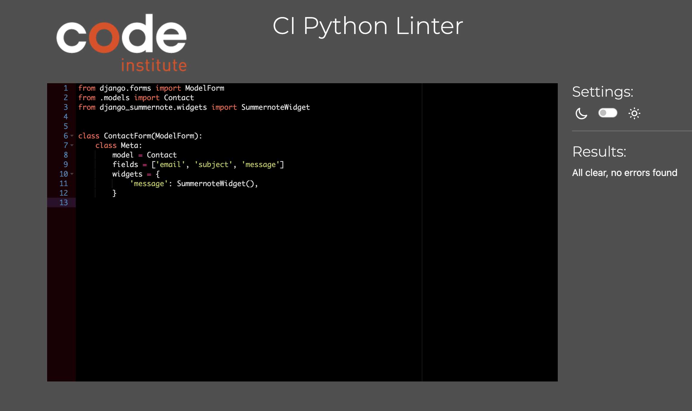

# Testing

Return back to the [README.md](README.md) file.

## Code Validation

### HTML

I have used the recommended [HTML W3C Validator](https://validator.w3.org) to validate all of my HTML files.

| Page  | Screenshot | Notes |
| ---|  --- | --- |
| Home||pass(No Errors)|
| About| |Pass (No Errors)|
| Search| | Pass(No Errors) |
| Login| |Pass(No Errors)|
|Logout||Pass(No Errors)|
|Register| | Errors form Django Form(not visible in template ) |
|Create-post|| Errors form Django Form(not visible in template, its caused by editor) |
|Create-post| |Pass(No Error after uninstalling Editors)|
|Update-Post| |Pass(No Errors)|
|Update-Post||Errors form Django Form(not visible in template, its caused by editor)|
|Delete-Post||Pass(No Errors)| 
|Post-Detail| |Errors(Not visible in templete) |
|Contact-us||Pass(No Errors)|
|Profile| |Pass(No Errors)|
|Password-reset 1||Pass(No Errors)|
|Password-reset 2||Pass(No Errors)|
|Password-reset 3| |Pass(No Errors)|
|Password-reset 4| |Pass(No Errors)|

### CSS

I have used the recommended [CSS Jigsaw Validator](https://jigsaw.w3.org/css-validator) to validate all of my CSS files.

| File | Screenshot | Notes |
| --- | --- | --- | 
|Parentingram| |Pass(No Errors)|

### JavaScript

I have used the recommended [JShint Validator](https://jshint.com) to validate all of my JS files.

| File | Screenshot | Notes |
| --- | --- | --- |
| comments.js |  | Pass: No Errors |
| create-post.js |  | Pass: No Errors |
| sign-up.js |  | Pass: No Errors |

### Python

I have used the recommended [PEP8 CI Python Linter](https://pep8ci.herokuapp.com) to validate all of my Python files.

#### Validation For Parentingram
| File | CI URL | Screenshot | Notes |
| --- | --- | --- | --- |
| asgi.py | [PEP8 CI]() |  | Pass: No Errors |
| settings.py | [PEP8 CI]() |  | Pass: No Errors |
| urls.py | [PEP8 CI]() |  | : 1 Errors(Long Line Error) |
| wsgi.py | [PEP8 CI]() |  | Pass: No Errors |

#### Validation For blog App
| File | CI URL | Screenshot | Notes |
| --- | --- | --- | --- |
| admin.py | [PEP8 CI]() |  | Pass: No Errors |
| apps.py | [PEP8 CI]() |  | Pass: No Errors |
| forms.py | [PEP8 CI]() |  | Pass: No Errors |
| models.py | [PEP8 CI]() |  | :  No Errors |
| views.py | [PEP8 CI]() |  | : Error 501(line too long) |
| urls.py | [PEP8 CI]() |  | : Error 501(line too long) |

#### Validation For about App
| File | CI URL | Screenshot | Notes |
| --- | --- | --- | --- |
| admin.py | [PEP8 CI]() |  | Pass: No Errors |
| apps.py | [PEP8 CI]() |  | Pass: No Errors |
| models.py | [PEP8 CI]() |  | Pass: No Errors |
| urls.py | [PEP8 CI]() |  | Pass: No Errors |
| views.py | [PEP8 CI]() |  | Pass: No Errors |

#### Validation For contact-us App
| File | CI URL | Screenshot | Notes |
| --- | --- | --- | --- |
| admin.py | [PEP8 CI]() |  | Pass: No Errors |
| apps.py | [PEP8 CI]() |  | Pass: No Errors |
| models.py | [PEP8 CI]() |  | Pass: No Errors |
| form.py | [PEP8 CI]() |  | Pass: No Errors |
| urls.py | [PEP8 CI]() |  | Pass: No Errors |
| views.py | [PEP8 CI]() |  | :  Errors 501(line too long) |

## Browser Compatibility

I've tested my deployed project on  browsers to check for compatibility issues.

* It was working fine on safari.((home page is little slow to load))
* it was working fine on chorome.(home page is little slow to load)

## Responsiveness

I've tested my deployed project on multiple devices to check for responsiveness issues.

I have cheked responsivness on various screen, here are the results for Desktop, Tablet and Mobile Phone.

|Screen|Result|
|---|---|
|Desktop||
|Tablet||
|Mobile phone||

## Lighthouse Testing:

### Website App Templates -Testing
| Page |Screenshot | ---|
| --- | --- | --- |
| Home |   | 
| About |   | 
| Contact-us |   | 
| Create-post |  | 
| Update-post |   | 
| Post-Detail |  | 
| Delete-post |  |
| Seach-post |  | 
| Login |  |
| Logout |   | 
| Register  |   | 
| Profile| |
| Password-1| |
| Password-2| |
| Password-3| |
| Password-4| |

#### Note:

("I have warnings in Lighthouse due to two Bootstrap CSS files. I use Summernote for the admin panel and CKEditor for creating and updating posts on the front-end. I could not Fixed it due to shortage of time.")

## Defensive Programming

Defensive programming was manually tested with the below user acceptance testing:

| Page | User Action | Expected Result | Pass/Fail | Comments |
| --- | --- | --- | --- | --- |
| Nav links | | | | |
|Home| Click on Home link in navbar | Redirection to Home page | Pass | |
|About| Click on About link in navbar | Redirection to About page | Pass | |
|Register| Click on Register link in navbar | Redirection to Register page | Pass | |
|Sign-in| Click on Login link in navbar | Redirection to sign-in page | Pass | |
|Feature image | Click on post Image | Redirection to that post details page | Pass | |
|Next| Click on Pagination next double arrow | Redirection to next pagination page | Pass | |
|Previous | Click on Pagination previus double arrow | Redirection to previous pagination page | Pass | |
|Search | Click on Search button in navbar |redirects to search page |Pass | |
|Create| click on Create link in navbar is only visible when user is loggedin| open Create post page|  Pass|  |
|Profile| click on Profile link in navbar is only visible when user is loggedin| open Profile page|  Pass|  |

## Submit Form Validation:
 |Form name|Pass/Fail|
 |----|-----|
 |Register:| Pass|
 |Sign In:| Pass|
 |Forgot Password:| Pass|
 |password Reset:| Pass|
 |Create post:| Pass|
 |Update post:| Pass|
 |Contact Us:| Pass|
 |Delete Post:| Pass|

 ## Custom Error Pages:

I have added added 4 error pages in all of the apps:

* 403 Error
* 404 Error
* 405 Error
* 500 Error

## Bugs and Fixes:

-  Home page:  
homepge  page was not opening.

   
- Sulution:
     To fix this, i logged in in admin pannel and deleted the last post(with out slug), and then it started working.

-  Author:

    
Bug:
   I have an author field on my create post page which have foriegn key and was display all the user names as option.

Solution:
    To fix it, I removed author field form form and added it in create post view.

 - Slug-field: 

 Bug: 
    I have slug field in my create post form, but users were unaware of slug term.

 solution:
    I hide slug field using form label to empty string and used java script to target input field, then I added in the model to slugify title of the post and add it in the form.

- Search:

 Bug:
  I had error 404 for search page.

 solution:
        I fixed it by changing the order of url paths

- Error 404:

Bug:
  There was an error opening the post detail.

solutioon: 
    I fixed it by fixing the url postion.

 - Data base error:

Bug:
  There was an error i was unable to access my website.

      

 solution:
    I was able to fix it with the help of tutor support, who advised me to delete all migrations and then use a new data base.

-  Footer:

Bug:
  on some pages Footer was float at top, i tried position(stickey,fixed,absolute,static). But they all were not working same on all pages.

solutions:
    I fixed footer by adding margin-top in css.

## Unfixed Bugs

* There are few bug in Django formm and sumernote that are seen in html validation. I was unable to clear them.

* There are Two errors in the terminal that i am unable to fix they are from gitpod."ms-toolsai.vscode-jupyter-slideshow extension is not synced, but not added in .gitpod.yml".

